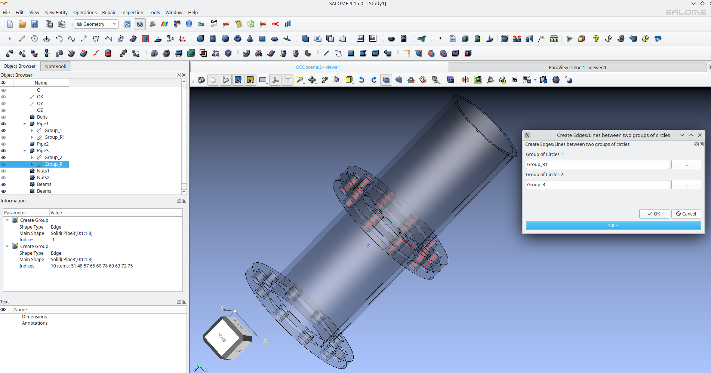
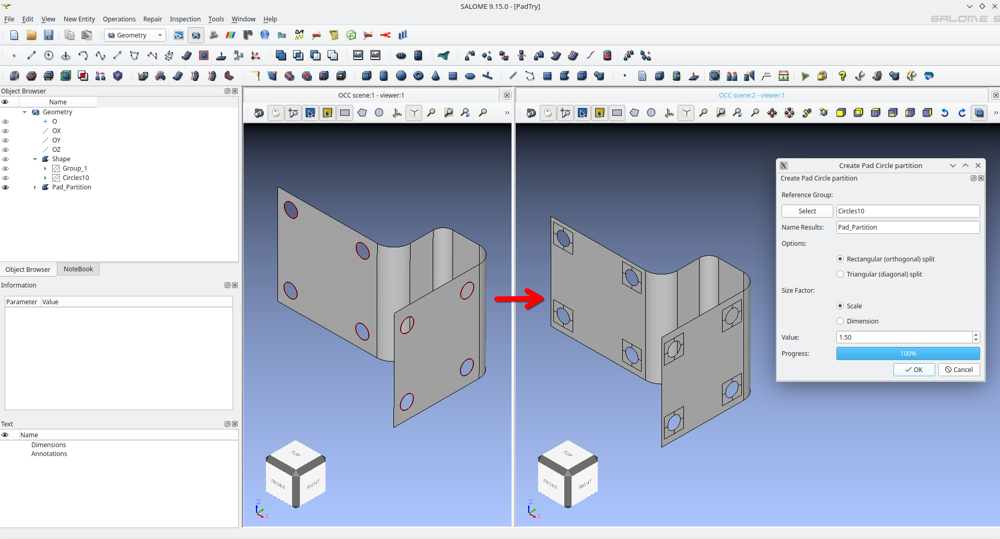
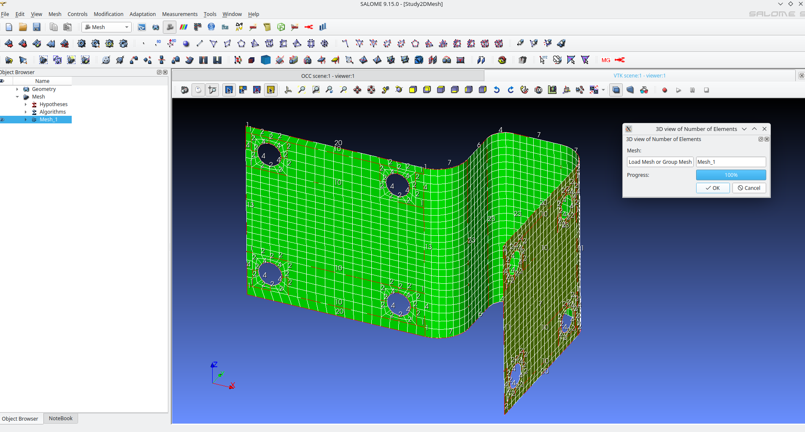

# Salome_Plugins

Collection of scripts for the Salome platform.

# Install Instructions

**On Linux**:

Copy the Plugins folder and its contents to the following address:

* /home/USER_NAME/.config/salome

change USER_NAME by your username

**On Windows**:

Copy the Plugins folder and its contents to the following address:

* C:/Users/USER_NAME/.config/salome

change USER_NAME by your username

**On Salome_Meca**:

Use the bind option with the salome_meca launcher. 

* --bind "/home/$USER/.config/salome" "/home/salome/.config/salome"

## Geom Plugins

Video Demostration: https://www.youtube.com/watch?v=W_JMXui-vkI

### Pass similar Group

After an operation in the geometry module the groups are lost and must be done again. 
With this script you can pass the groups (or the majority) after performing an operation to the part.

Autor: @psicofil (Lucio Gomez)

### Filter Group

Creating Geometry groups in the GEOM module using features and properties of another group.

Autor: @psicofil (Lucio Gomez)

Video Idea Demostration (Old Video): https://www.youtube.com/watch?v=Nil1zQtyf_8

### 3D Contact

Script to automatically detect contacts of two o more parts.

Autor: @psicofil (Lucio Gomez)

Video Idea Demostration (Old Video): https://www.youtube.com/watch?v=QTaSs1JFrHw

### Create Edges/Lines between two groups of circles

Create edges/lines between two groups or compounds of circles. Useful for beam-bolt models.

Autor: @psicofil (Lucio Gomez)

### Hole Partition

Creates a radial “pad” layout, splitting the area around a hole into four blocks suitable for mapped meshing

Autor: @psicofil (Lucio Gomez)

## Mesh Plugins

### Belong to Geometry

Create mesh groups from geometry, even if the link does not exist.

Autor: @psicofil (Lucio Gomez)

### Edge Element Distribution - Number of Elements

Displays a three-dimensional visualization of the number of mesh elements along each edge of a mesh or mesh group, providing an immediate view of edge-wise element distribution.
Note: Performance is not optimal; I recommend using mesh groups rather than a global mesh.

Autor: @psicofil (Lucio Gomez)

