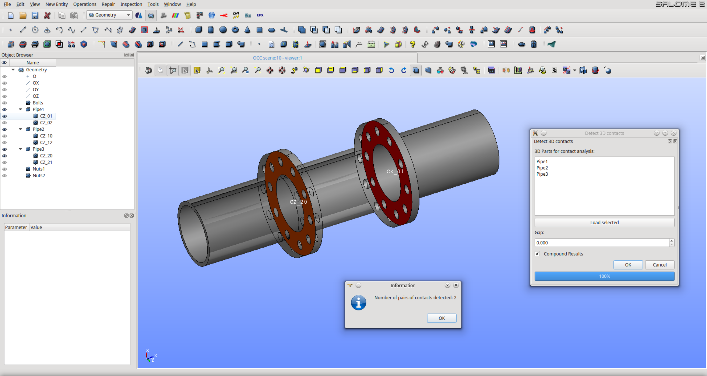
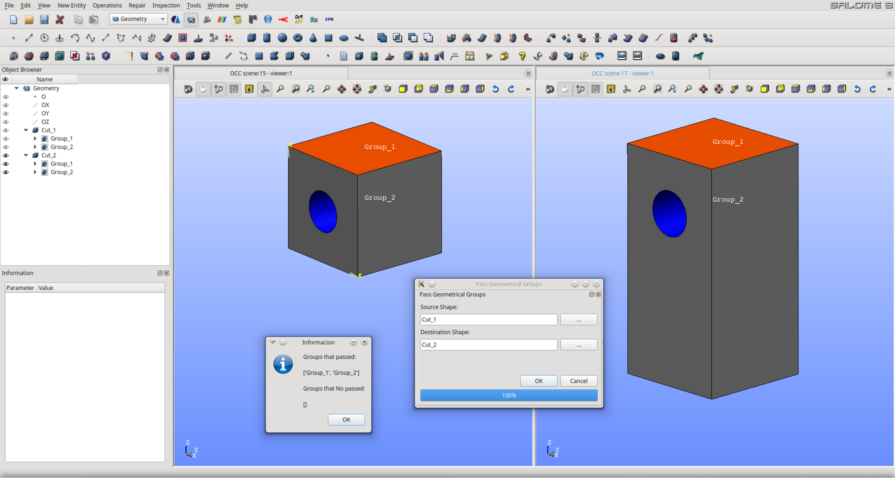

# Salome_Plugins

Collection of scripts for the Salome platform.

## Geom Plugins

### Filter Group

Creating Geometry groups in the GEOM module using features and properties of another group.

Original Source: https://github.com/psicofil/Salome_Scripts

Autor: @psicofil (Lucio Gomez)

Video Idea Demostration (Old Video): https://www.youtube.com/watch?v=Nil1zQtyf_8

### 3D Contact

Script to automatically detect contacts of two o more parts.

Original Source: https://github.com/psicofil/Salome_Scripts

Autor: @psicofil (Lucio Gomez)

Video Idea Demostration (Old Video): https://www.youtube.com/watch?v=QTaSs1JFrHw

### Pass similar Group

After an operation in the geometry module the groups are lost and must be done again. 
With this script you can pass the groups (or the majority) after performing an operation to the part.

Original Source: https://github.com/psicofil/Salome_Scripts

Autor: @psicofil (Lucio Gomez)

### Internal Contour

Auto-selects the internal contour of a part. You have 2 options, select only the internal surface and set it as a group (for FEM), or create a new part with the control volume (for CFD).

Original Source: https://github.com/psicofil/Salome_Scripts

Autor: @psicofil (Lucio Gomez)

Video Idea Demostration (Old Video): https://www.youtube.com/watch?v=XkzQoCLW-MI

## Mesh Plugins

### Belong to Geometry

Create mesh groups from geometry, even if the link does not exist.

Original Source: https://github.com/psicofil/Salome_Scripts

Autor: @psicofil (Lucio Gomez)

### Mesh whit Gmsh mesher

Macro/script to create mesh inside of Salome Platform with GMSH mesher.

Original Source: https://github.com/psicofil/Salome_Scripts

Autor: @psicofil (Lucio Gomez)

Video Idea Demostration (Old Video): https://www.youtube.com/watch?v=sRjfJeXBlBY

